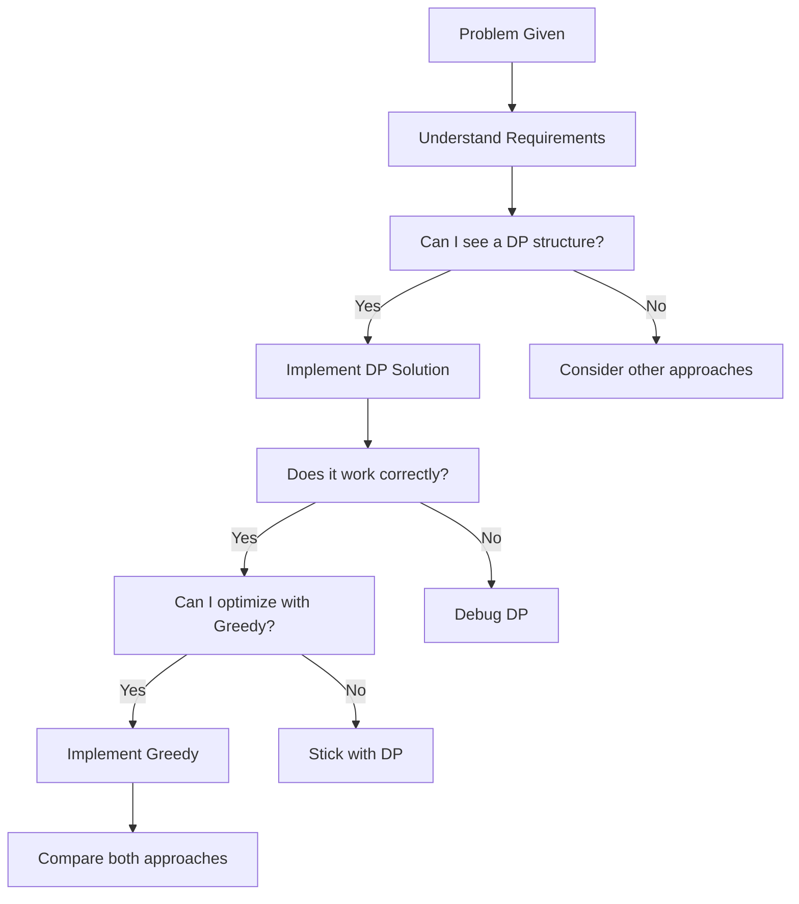

# DP vs Greedy: A Deep Comparison for Jump Game II

## 🎯 The Tale of Two Paradigms

Jump Game II is fascinating because it can be solved with **both** Dynamic Programming and Greedy approaches. Understanding when and why each works teaches you fundamental algorithmic design principles.

## 📊 Quick Comparison Table

| Aspect | Dynamic Programming | Greedy (BFS-Style) |
|--------|---------------------|---------------------|
| **Time Complexity** | O(n²) | O(n) |
| **Space Complexity** | O(n) | O(1) |
| **Intuition** | "Try all possibilities, keep the best" | "Always make the locally optimal choice" |
| **Implementation** | Moderate difficulty | High difficulty |
| **Debugging** | Easy to trace and debug | Harder to debug |
| **Interview Value** | Shows systematic thinking | Shows advanced optimization |
| **Learning Value** | Fundamental DP patterns | Advanced algorithm design |

## 🧠 Dynamic Programming Deep Dive

### The DP Mindset: "What if I knew everything?"

DP says: *"Let me systematically explore every possible way to reach each position and remember the best one."*

```java
// DP Translation: "To reach position i, what's the best way?"
for (int i = 0; i < n; i++) {
    for (int j = i + 1; j <= i + nums[i]; j++) {
        dp[j] = Math.min(dp[j], dp[i] + 1);  // Try this path, keep if better
    }
}
```

### DP Strengths

✅ **Systematic and Comprehensive**
- Considers all possible paths
- Guarantees optimal solution
- Easy to verify correctness

✅ **Intuitive Problem Solving**
- Mirrors human reasoning: "What are my options?"
- Natural decomposition into subproblems
- Clear state transitions

✅ **Great for Learning**
- Builds algorithmic thinking
- Applicable to many problem types
- Easy to modify for variations

### DP Weaknesses

❌ **Performance Overhead**
- O(n²) time complexity
- O(n) space complexity
- Redundant computations

❌ **Scalability Issues**
- Slow for large inputs
- Memory-intensive

### When to Use DP
1. **Learning Phase**: Understanding the problem structure
2. **Complex Variations**: When greedy property doesn't hold
3. **Interview Settings**: To demonstrate systematic thinking
4. **Debugging**: When you need to trace all states

## 🏃 Greedy Deep Dive

### The Greedy Mindset: "Trust the optimal local choice"

Greedy says: *"I'll make the best choice available right now and trust it leads to the global optimum."*

```java
// Greedy Translation: "Within my current 'level', how far can I go?"
for (int i = 0; i < n - 1; i++) {
    farthest = Math.max(farthest, i + nums[i]);  // Track best option
    
    if (i == currentEnd) {        // End of current level
        jumps++;                  // Commit to jump
        currentEnd = farthest;    // Move to next level
    }
}
```

### Greedy Strengths

✅ **Optimal Performance**
- O(n) time complexity
- O(1) space complexity
- Single pass through array

✅ **Elegant and Concise**
- Minimal code
- Clear algorithmic insight
- Shows deep understanding

✅ **Scalable**
- Handles large inputs efficiently
- Memory-friendly

### Greedy Weaknesses

❌ **Difficult to Derive**
- Requires deep insight
- Not obvious why it works
- Hard to prove correctness

❌ **Limited Applicability**
- Only works when greedy property holds
- Fails on many similar problems
- Brittle to problem variations

❌ **Debugging Challenges**
- Hard to trace execution
- Subtle bugs difficult to find

### When to Use Greedy
1. **Performance Critical**: Large datasets
2. **Production Code**: When efficiency matters
3. **Advanced Interviews**: After demonstrating DP understanding
4. **Competitive Programming**: Time-constrained environments

## 🔬 Side-by-Side Algorithm Analysis

### Example: `nums = [2,3,1,1,4]`

#### DP Execution Trace
```
Step 0: Initialize dp = [0, ∞, ∞, ∞, ∞]

Step 1: From position 0 (value=2)
  → Can reach positions 1, 2
  → dp = [0, 1, 1, ∞, ∞]

Step 2: From position 1 (value=3)
  → Can reach positions 2, 3, 4
  → dp = [0, 1, 1, 2, 2]

Step 3: From position 2 (value=1)
  → Can reach position 3
  → dp = [0, 1, 1, 2, 2] (no change)

Result: dp[4] = 2
```

#### Greedy Execution Trace
```
Level 0: Can reach from start: position 0
Level 1: From level 0, can reach: positions 1, 2
Level 2: From level 1, can reach: positions 3, 4

Jumps needed: 2 (same result!)
```

### Why Both Work

The key insight: **Jump Game II has the optimal substructure property that makes greedy work.**

**Greedy Property**: *"If I want to reach the farthest possible position in k jumps, I should always jump to the position that maximizes my reach in k+1 jumps."*

This is NOT true for all problems! Consider:

## 🚫 When Greedy Fails: Counter-Example

**Problem**: Find minimum jumps, but each jump has a cost equal to the distance jumped.

**Example**: `nums = [2,3,1,1,4]`, costs = distance of jump

#### DP Approach (Correct)
- Path 0→1→4: Cost = 1 + 3 = 4
- Path 0→2→3→4: Cost = 2 + 1 + 1 = 4
- Both are optimal

#### Naive Greedy (Wrong)
- Always jump maximum distance: 0→2→4
- Cost = 2 + 2 = 4
- Happens to work for this example, but fails in general

**Counter-example**: `nums = [2,1,1,1,1,4]`
- Greedy: 0→2→4 (cost = 2 + 2 = 4)
- Optimal: 0→1→2→3→4→5 (cost = 1+1+1+1+1 = 5, wait this is worse!)

Actually, let me think of a better counter-example where greedy fails...

**Better Counter-example**: Shortest path in weighted graph
In graphs, greedy (always pick cheapest edge) fails, but DP-based algorithms (Dijkstra, Bellman-Ford) work.

## 🎯 Interview Strategy: When to Use Which

### The Golden Approach



### Template Interview Response

**Phase 1: Show Understanding (2-3 minutes)**
```
"This is an optimization problem where I need to find the minimum number of jumps. 
I can see this has optimal substructure - the minimum jumps to position i depends 
on the minimum jumps to previous positions. Let me start with a DP approach to 
show the systematic solution..."
```

**Phase 2: Implement DP (5-7 minutes)**
```java
// Implement DP solution with clear explanation
"My state is dp[i] = minimum jumps to reach position i..."
```

**Phase 3: Discuss Optimization (2-3 minutes)**
```
"Now, this problem actually has a special property where we can use a greedy 
approach. The insight is that we can think of this as BFS levels..."
```

**Phase 4: Implement Greedy (3-5 minutes)**
```java
// Implement greedy if time permits
"The greedy approach treats this like BFS where each jump represents a level..."
```

## 🎓 Learning Progression

### Beginner Level
1. **Focus on DP**: Master the systematic approach
2. **Understand the framework**: State, transition, base cases
3. **Practice similar problems**: Coin Change, Perfect Squares

### Intermediate Level
1. **Learn greedy principles**: When does greedy work?
2. **Study the BFS connection**: Levels and optimal choices
3. **Compare approaches**: Performance vs clarity trade-offs

### Advanced Level
1. **Recognize greedy opportunities**: Matroid theory, exchange arguments
2. **Prove correctness**: Formal analysis of greedy choices
3. **Design variations**: Create problems where one approach fails

## 🔍 Deep Insight: Why Greedy Works Here

The mathematical reason greedy works for Jump Game II:

**Exchange Argument**: If there's an optimal solution that doesn't follow the greedy choice, we can "exchange" parts of that solution to create an equally good solution that does follow the greedy choice.

**Formal Proof Sketch**:
1. Suppose optimal solution uses k jumps
2. At any level, if we don't jump to the farthest reachable position, we can "exchange" later jumps to reach the same final position
3. This exchange doesn't increase the total number of jumps
4. Therefore, greedy choice is safe

## 💡 Key Takeaways

1. **DP is the foundation**: Learn it first, it applies broadly
2. **Greedy is the optimization**: Use when you understand why it works
3. **Both have value**: DP for learning, Greedy for performance
4. **Start systematic**: Always begin with the more general approach
5. **Optimize when proven**: Only switch to greedy after understanding the problem deeply

The journey from DP to Greedy mirrors your growth as an algorithm designer - from systematic problem-solver to elegant optimizer!